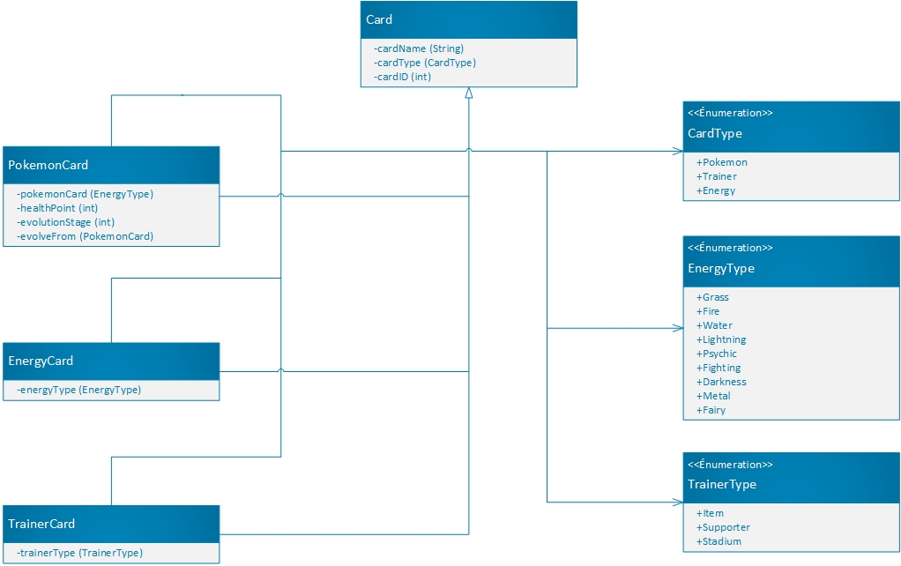

# Pokedeck
Pokedeck est un projet scolaire Java. Il n'a pas pour but d'être amélioré ultérieurement après le 23/03/17.

La finalité du projet est de créer un Pokedex en Java à partir du jeu de cartes Pokemon. Le projet est dépendant de Maven.

L'interface graphique utilisée est swing (peut ne plus fonctionné dans le futur, car 
[déprécié](http://www.oracle.com/technetwork/java/javafx/overview/faq-1446554.html#6) par Oracle).

[TOC]

## L'interface utilisateur
Lorsque le Pokedeck démarre, il tente de charger un fichier nommé "cards.ser". Si il n'est pas présent, un message 
apparaitra indiquant qu'une nouvelle sauvegarde sera créée.

Le pokedeck se découpe en 4 parties : 
- Le panel des boutons d'édition de cartes 
- La liste des cartes enregistrées 
- Le tableau de donnée de la carte sélectionnée 
- La fenêtre d'édition des cartes
 
Lors du premier lancement, les fonctions "édit" et "delete" ne fonctionnent pas, car une carte doit être sélectionnée 
dans la liste.

Lorsque vous ajoutez une carte, seul le champ nom est obligatoire. En fonction du type de carte, certains champs ne 
sont pas disponibles.

Une fois votre carte créée, vous pouvez la sélectionner dans la liste. Une fois sélectionné, vous pouvez voir apparaitre 
ses valeurs dans le tableau de droite. Vous pouvez également éditer ou supprimer la carte.

**Note** : Lors de l'édition d'une carte pokemon, le champ "evolve from" est une référence à une autre carte et pas le nom du pokemon.

**Example** : Vous avez 2 pokemon, Salamèche et Reptincel. Salamèche n'évolue d'aucun pokémon, sa valeur "evolve from" 
est "NONE".Reptincel évolue de Salamèche, sa valeur "evolve from" est "Salamèche". Si vous supprimez la carte Salamèche, 
la valeur "evolve from" de Reptincel sera toujours sur Salamèche. Cependant lorsque vous voudrez modifier la carte 
Reptincel, sa valeur "evolve from" sera sur "NONE", car la référence à la carte Salamèche n'existe plus.

## Logique de code
Le code est découpé en 3 parties :
 - Le Main.
 - Le package cards.
 - Le package ui.

Le Main est simplement le point d'entrée du programme, c'est lui appelé la fenêtre principale dans le package ui.

Le package cards contient toutes les classes permettant de créer / éditer des cartes pokemons.

Le package ui confie l'interface graphique ainsi que les fonctions d'affichage. Il contient également les fonctions de 
sauvegardes (_refactoring requis_).

**Diagramme du package cards**

## Difficulté et solution
La plus grande difficulté a été de comprendre les interfaces utilisateur. N'ayant jamais fait d'UI en natif, j'ai mis 
beaucoup de temps à expérimenter des fenêtres diverse et variée. 

Je passais beaucoup de temps pour arriver un résultat peu convaincant. Quand j'ai découvert que mon IDE me permettait de
 réaliser des UIs beaucoup plus rapidement et avec facilité, j'ai opté pour cette solution.

La sérialisation en JSON a été abandonnée malgré la facilité d'intégration avec le gestionnaire de projet Maven. Les 
objets sauvegardés n'étaient plus les mêmes au chargement du programme (_La notion d'objet avait disparu_).

## Conclusion
Un projet fort intéressant, car il m'a permit de découvrir les interfaces utilisateur sur un laquage "natif". Java ne manque 
pas de guide, documentation ou autre tutoriel, cependant ils m'ont interpellé sur l'ancienneté de ces documents 
(plus de 10 ans pour certains). Il m'a également permis de voir que c'est bel et bien le web qui m'attire le plus et 
non l'applicatif.